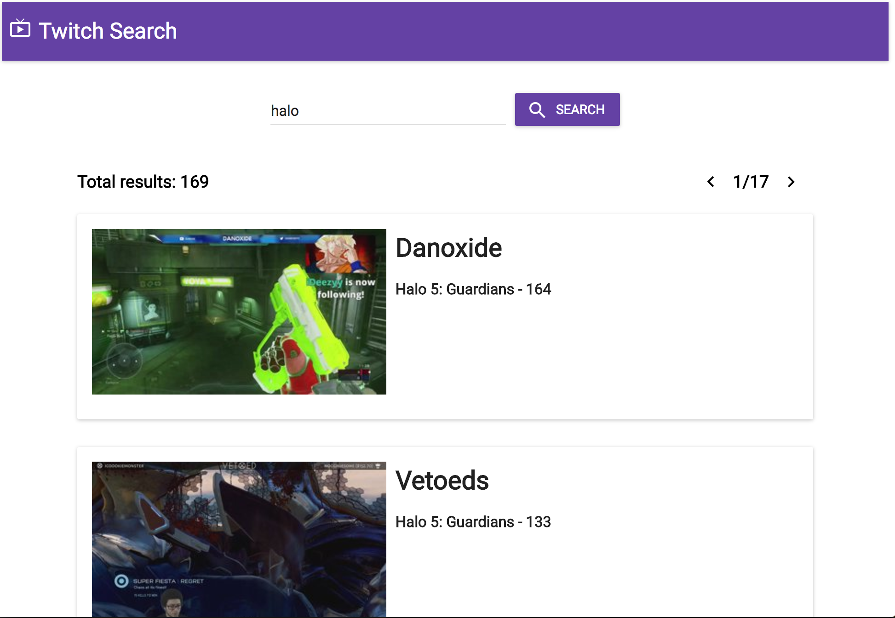

# Twitch Search

This app interacts with the Twitch Public API and retrieve a list of stream channels based on search query entered by user.

Screenshot:

## Tools

- Yarn
  - Package manager

- Webpack
  - Runs Babel, then bundles front-end files and places it into `/public/bundle.js`.

- Express
  - Used to build a simple server to render static content (found in `/public`) and listens on port `3000` by default.

- ReactJS
  - Allows structuring front-end code with components.

- ESLint
  - Linter tool

## How to Run

1. Clone the repo
2. (If you don't have Yarn) install yarn with `npm install yarn -g`
3. Install packages with `yarn`
4. Run the app with `yarn run dev`. App is served at `localhost: 3000`

## Development Process

### 1. Initial thoughts
After getting the requirement document, I have a few initial thoughts on the implementation plan. First of all on the libraries and frameworks to use, I chose to go with Node.js `Express` server as the backend. As for the front-end, I am most familiar with `ReactJS`. Although I'd love to try `Ember`, I decided to finish it first with the libraries that I am most comfortable with.

### 2. Project base
Setting up a new project with a set of new tools sometimes can be unnecessarily complicated and time consuming. That's why a friend of mine @colinharris05 and I created a Node.js project template with `yarn`, `webpack`, `express`, `react` and `ESLint` which will serve as a starting point for future development. This project is also built on top of the template which saved me the troubles of project setup.

### 3. Reading the docs
Before the detailed implementation, I decided to take a look at the Twitch API Documentations. In the `search` section I found several examples of requests that I will be interacting with. The example response also gave me a basic idea of the information I will extract out including game name, channel details and the number of viewers.

### 4. Front end implementation
Instead of using default HTML styling, I chose to use `Material UI`. It is a powerful react components library which implements the `Google Material Design` guidelines. It looks clean and elegant and is very simple to use. This saves my a large amount of time styling the views but meanwhile gives me the flexibility to config the components to whatever theme I want to.

The front end will consists of several simple components including an `App bar`, which serves as the title for the site, a `Search bar` that reads the search query keyword and `Content`. The `Content` will display a prompt for user to search and also the detailed search results along with the number of search results and pagination. The front end will make a `http` request with `axios`. The request contains the search keyword and the page number the user is currently viewing.

When rendering the search results, I couldn't find the description text for the stream described in the assignment. It is possible that Twitch updated their API and not includes the description anymore. So I left it empty in the app.

### 5. Back end implementation
The back end of the project is simply just an `express` server. The server take charge of receiving the keyword and page number sent from the front end and then make the appropriate `GET` request to Twitch API. After getting the search results, the server will send back the data to the front end for rendering.
